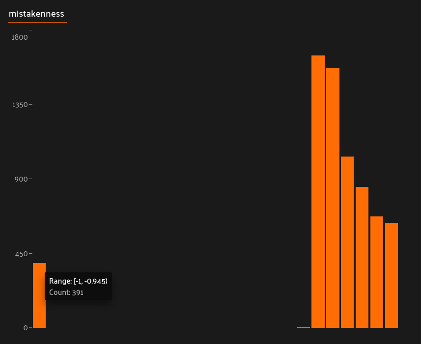
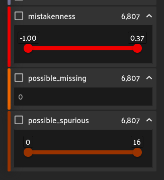

# Questions about compute_mistakenness

When I compute mistakenness using:
```
fob.compute_mistakenness(
    samples=dataset, 
    pred_field="yolo", 
    label_field="ground_truth", 
    copy_missing=True)
```
three fields are added to my dataset samples: mistakenness, possible_missing, and possibly_spurious. 

The mistakenness histogram shows a bimodal ditribution which includes negative values:


            
And the value of the possible_missing field is 0 for all samples:

